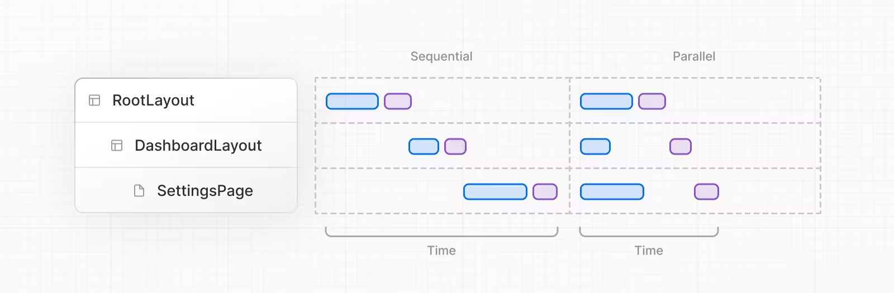
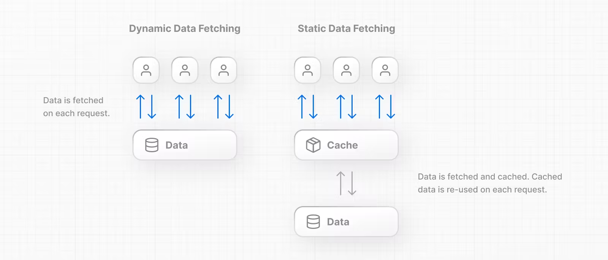

# Data Fetching

## The fetch() API
- Hệ thống fetch data được build dựa trên web API và sử dụng tính năng async await trên Server cpns
- React mở rộng *fetch* để auto cung cấp request
- Mở rộng *fetch* đối tượng tùy chọn cho phép mỗi yêu cầu đặt các quy tắc xác nhận lại và bộ nhớ đệm riêng của nó
## Fetching data on server
Bất cứ khi nào có thể, chúng tôi khuyên bạn nên *fetch data* trong Cấu phần server. Thành phần server luôn *fetch data* trên server. Điều này cho phép bạn:
- Có quyền truy cập trực tiếp vào tài nguyên dữ liệu phụ trợ (ví dụ: cơ sở dữ liệu).
- Giữ cho ứng dụng của bạn an toàn hơn bằng cách ngăn không cho thông tin nhạy cảm, chẳng hạn như mã thông báo truy cập và khóa API, tiếp xúc với ứng dụng khách.
- *fetch data* và kết xuất trong cùng một môi trường. Điều này làm giảm cả giao tiếp qua lại giữa client và server, cũng như công việc trên luồng chính trên client.
- Thực hiện nhiều lần *fetch data* với một lượt khứ hồi thay vì nhiều yêu cầu riêng lẻ trên client.
- Giảm thác nước client-server.
- Tùy thuộc vào khu vực của bạn, quá trình *fetch data* cũng có thể diễn ra gần nguồn dữ liệu của bạn hơn, giúp giảm độ trễ và cải thiện hiệu suất.

# Fetching Data at the component level
- Trong app router, bạn có thể fetch data bên trong layouts,pages, cps. 
- Nextjs gợi ý nên fetch data bên trong layout cần dữ liệu đó, ngay cả khi bạn đang yc cùng 1 dữ liệu nhiều lần trong route, react và nextjs sẽ lưu vào bộ nhớ đệm và loại trừ các yêu cầu để tránh việc cùng 1 dữ liệu dc tìm nạp nhiều lần

# Parallel and Sequential Data Fetching : Tìm nạp dữ liệu song song và tuần tự trong component

## Parallel data fetching :
Các yêu cầu trong một tuyến đường được bắt đầu một cách háo hức và sẽ tải dữ liệu cùng một lúc. Điều này làm giảm thác nước máy khách-máy chủ và tổng thời gian cần thiết để tải dữ liệu.

## Sequential data fetching :
các yêu cầu trong một tuyến phụ thuộc vào nhau và tạo ra các thác nước. Có thể có trường hợp bạn muốn mẫu này vì một lần tìm nạp phụ thuộc vào kết quả của lần tìm nạp khác hoặc bạn muốn một điều kiện được thỏa mãn trước lần tìm nạp tiếp theo để tiết kiệm tài nguyên. Tuy nhiên, hành vi này cũng có thể không chủ ý và dẫn đến thời gian tải lâu hơn.

## Automatic fecth() request
- fetch data về user ở nhiều cpn, nextjs auto catched
- catche sẽ tồn tại trong suốt thời gian yêu cầu của server cho đến khi render hoàn tất
- Trên client, catch kéo dài có thể gồm nhiều lần render lại phía máy khách cho đến khi page tải lại toàn bộ

## Static and Dynamic Data Fetching
Có hai loại dữ liệu: Tĩnh và Động.
- Dữ liệu tĩnh là dữ liệu không thay đổi thường xuyên. Ví dụ, một bài đăng trên blog.
- Dữ liệu động là dữ liệu thay đổi thường xuyên hoặc có thể dành riêng cho người dùng. Ví dụ: danh sách giỏ hàng.

# Catching data
