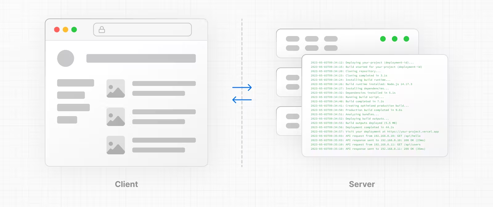

# Rendering
- Là quá trình chuyển đổi code mà bạn viết xang giao diện người dùng
## Những môi trường rendering
- Có 2 môi trường để ứng dụng của bạn có thể được render: Client, Server

- Client : Đề cập đến trình duyệt trên các thiết bị người dùng nơi sẽ gửi các request đến server cho mã nguồn ứng dụng. Và sẽ nhận được các phản hồi từ server vào trong giao diện để người dùng có thể tương tác
- Server : Đề cập để máy tính trong trung tâm dữ liệu dùng để lưu trữ mã nguồn ứng dụng, nơi nhận các request từ client, thực hiện 1 số tính toán và trả về phản hồi phù hợp với các request

# Component-level Client and Server Rendering (Render các component ở phía client và server)
- React 18 có cách render chính là sử dụng client
- Nextjs cung cấp 1 cách dễ dàng hơn là chia nhỏ app thành các trang và render trước trên server bằng cách tạo html và gửi nó lên client để react cung cấp trước. Tuy nhiên điều này dễ đến việc bạn cần có Javascript để tạo tính tương tác với html
- Hiện tại, với Server và Client Component, React có thể render trên client và server theo cách bạn chọn môi trường render ở các component
- Mặc định, app sử dụng app router sẽ sử dụng component máy chủ, cho phép bạn dễ dàng kết xuất các thành phần phía máy chủ và giảm lượng Javascript gửi đến máy khách

# Static and Dynamic Rendering on the Server
- Ngoài kết xuất phía máy khách và phía máy chủ với các thành phần React, Next.js cung cấp cho bạn tùy chọn để tối ưu hóa kết xuất trên máy chủ với Kết xuất tĩnh và Động.

## Static Rendering
- Các component ở client và server sẽ được render trước trên server tại thời điểm build. Kết quả được lưu vào bộ nhớ đệm và được tái sử dụng ở request tiếp theo
- Server and Client components được render trước có sự khác biệt :
+ Client cpn có : HTML, JSON được render trước và catched on server. Kết quả catched được gửi đến client để vẽ UI
+ Server cpn : render trước trên server bởi react, giá trị tải trước được dùng để tạo ra html, ko cần js ở client
## Dynamic Rendering
- Cả Server và Client cpn được render trước trên server tại thời điểm yêu cầu.

# Static and Dynamic Rendering
- static route : cpns được render trên server. kq được catched và tái sd ở lần yc tiếp theo
- dynamic route : cps được render trên server tại thời điểm yc

## Static rendering (Default)
- Mặc định, Nextjs render các static route để nâng cao hiệu suất. Tất cả sẽ được render thành công và lưu ở server 

## Static data fetching( Default )
- Nếu bất kỳ yêu cầu tìm nạp nào trong tuyến đường sử dụng tùy chọn *revalidate*, tuyến đường sẽ được kết xuất lại tĩnh trong quá trình xác thực lại.

# Dynamic Rendering
# Dynamic Functions
- Sử dụng cookies, headers in server cpns sẽ làm cho route trở thành dynamic rendering tại thời điểm yêu cầu
- Sử dụng useSearchParams in client cpns sẽ bỏ qua static rendering và render all client cpns cho đến khi suspense trên client
# Dynamic Data Fetching
