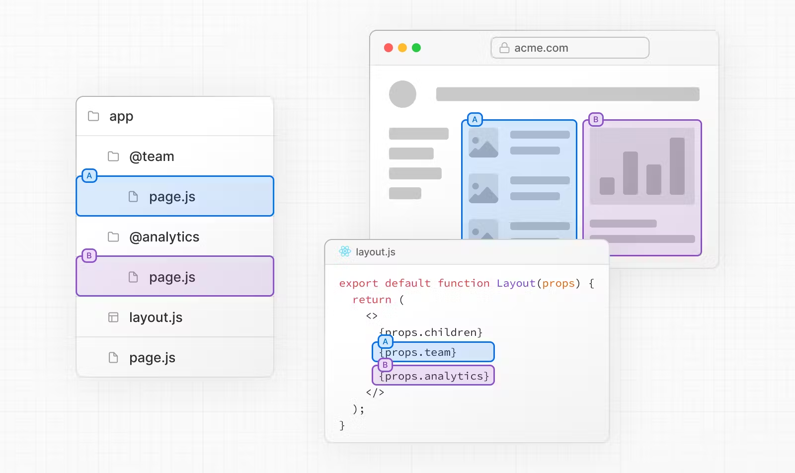
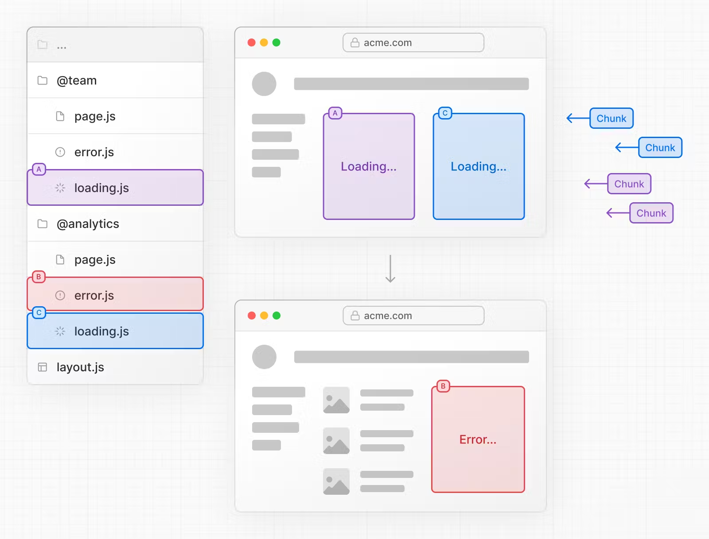
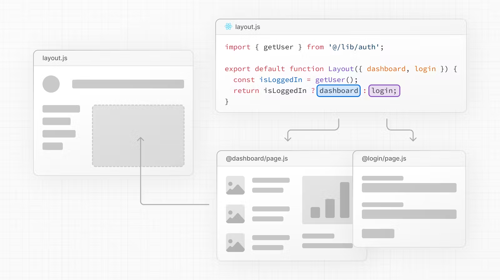
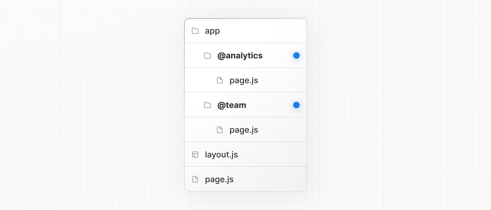
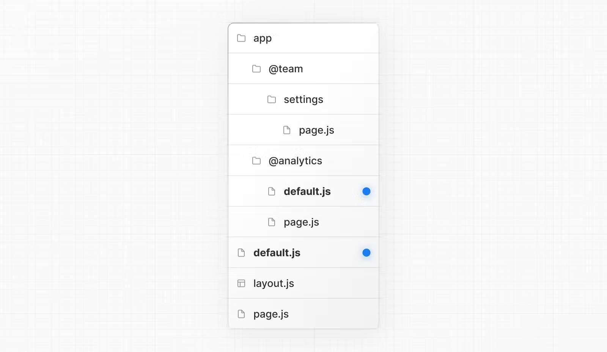
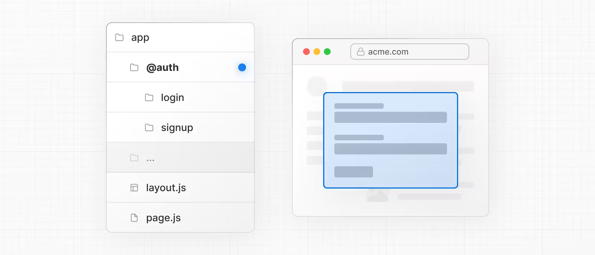
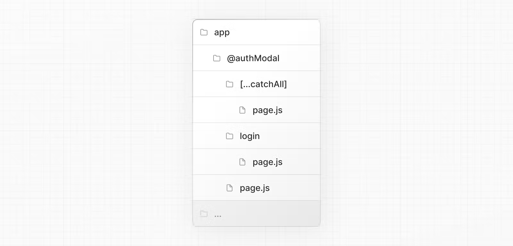

># **Parallel Routes**
- Định tuyến song song cho phép bạn hiển thị đồng thời hoặc có điều kiện một hoặc nhiều trang trong cùng một bố cục ( Hiển thị 1 hoặc nhiều file page trong 1 layout)
- Định tuyến song song có thể sử dụng để triển khai các mẫu định tuyến phức tạp



- Cho phép bạn xác định các trạng thái đang tải và lỗi độc lập cho mỗi route khi chúng được thực thi độc lập


- Cho phép bạn hiển thị có điều kiện một vị trí dựa trên các điều kiện nhất định, chẳng hạn như authen. Điều này cho phép phân tách hoàn toàn trên một URL


----
# Convention
- Các slot trong layout gốc được xác định bằng quy ước @folder, và được truyền đến layout cùng cấp dưới dạng prop
- Slot ko phải là thành phần của route nên không ảnh hưởng đến cấu trúc URL.
- Ví dụ> Trong folder app ta định nghĩa 2 slot là :@rout1, @rout2

> Cấu trúc thư mục ở trên có nghĩa là thành phần trong app/layout.js hiện chấp nhận các props @router1 và @router2 và có thể hiển thị chúng song song cùng với các prop con
```js
export default function Layout(props: {
  children: React.ReactNode
  analytics: React.ReactNode
  team: React.ReactNode
}) {
  return (
    <>
      {props.children}
      {props.team}
      {props.analytics}
    </>
  )
}
```

--- 
# Unmatched Routes
- Mặc định, nội dung trong slot được render khi trùng vời URL hiện tại nếu slot đó nằm trong layout của folder định nghĩa route của url hiện tại
- Trong trường hợp slot không khớp, nội dung mà Nextjs render sẽ khác nhau dựa trên kỹ thuật định tuyến và cấu trúc thư mục

## default.js
- Dùng để hiển thị dưới dạng dự phòng khi nextjs không thể khôi phục trạng thái active của Slot dựa trên URL hiện tại
Ví dụ:
- Trong folder account có 2 slot là @slot1, @slot2
- trong @slot1 có folder user chứa file page.js
- @slot2 có file default.js
- Mặc định khi /account sẽ chạy vào layout chứa 2 slot là @slot1,@slot2
- /account/user sẽ chạy vào route chứa folder user bên trong @slot1,@slot2
- Nếu slot nào ko có folder user sẽ tìm đến file defaul.js để hiển thị

- Nếu bạn navigate app/settings, nội dung sẽ được hiển thị khác nhau dựa trên loại điều hướng và tính khả dụng của default.js

1. Có file @analytics/default.js
Soft_navigation
- @team/settings/page.js
- @analytics/page.js
Hard_navigation
- @team/settings/page.js 
- @analytics/default.js
2. Không có file @analytics/default.js
Soft_navigation
- @team/settings/page.js
- @analytics/page.js
Hard_navigation : 404

### Soft Navigation
- Nextjs sẽ render những vị trí active trước, dù cho nếu nó không match với URL hiện tại
### Hard Navigation
- Navigation yêu cầu full page reload
- Nextjs sẽ tải lần đầu tiên những slot không match trên file default.js. Nếu nó không có, page 404 sẽ hiển thị
-----
# useSelectedLayoutSegment(s)
- Cả useSelectedLayoutSegment và useSelectedLayoutSegments đều chấp nhận một ParallelRoutesKey, cho phép bạn đọc đoạn tuyến đang hoạt động trong vị trí đó.
```js
'use client'
 
import { useSelectedLayoutSegment } from 'next/navigation'
 
export default async function Layout(props: {
  //...
  authModal: React.ReactNode
}) {
  const loginSegments = useSelectedLayoutSegment('authModal')
  // ...
}
```
-----
# Modals
- Routing lồng nhau có thể được sử dụng để render ra các modals

- The @authModal slot sẽ render ra cpn Modal và hiển thị khi điều hướng trùng với route

```js
export default async function Layout(props: {
  // ...
  authModal: React.ReactNode
}) {
  return (
    <>
      {/* ... */}
      {props.authModal}
    </>
  )
}
import { Modal } from 'components/modal'
 
export default function Login() {
  return (
    <Modal>
      <h1>Login</h1>
      {/* ... */}
    </Modal>
  )
}
```
- Để chắc chắn nội dung của modal không hiển thị khi nó không hoạt động bạn có thể tạo file default.js và trả về null

## Tắt Modal
- Nếu modal được active khi client chuyển hướng.
vd: click vào thẻ Link href='/login'
- Bạn có thể tắt modal đó bằng cách gọi router.back() hoặc sử dụng cpn Link
app/@authModal/login/page.tsx
```js
'use client'
import { useRouter } from 'next/navigation'
import { Modal } from 'components/modal'
 
export default async function Login() {
  const router = useRouter()
  return (
    <Modal>
      <span onClick={() => router.back()}>Close modal</span>
      <h1>Login</h1>
      ...
    </Modal>
  )
}
``` 
- Nếu bạn muốn điều hướng tới bất cứ đầu và tắt modal, bạn có thể sử dụng catch-all route : [...folder],[[...folder]]


app/@authModal/[...catchAll]/page.tsx
```js
export default function CatchAll() {
  return null
}
```
Catch-all có độ ưu tiên hơn defaul.js
----
# Conditional Routes
- Các tuyến song song có thể được sử dụng để thực hiện định tuyến có điều kiện. Ví dụ: bạn có thể hiển thị tuyến đường @dashboard hoặc @login tùy thuộc vào trạng thái xác thực.
app/layout.tsx
```ts
import { getUser } from '@/lib/auth'
 
export default function Layout({ params, dashboard, login }) {
  const isLoggedIn = getUser()
  return isLoggedIn ? dashboard : login
}
```
