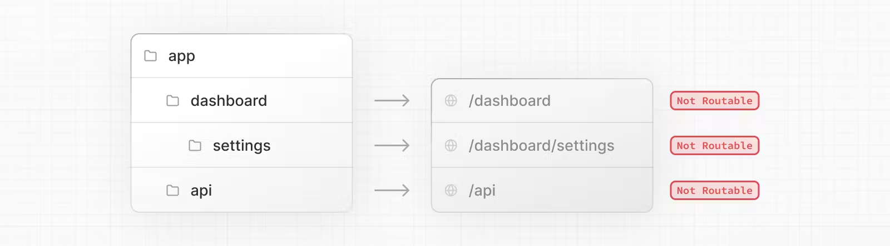
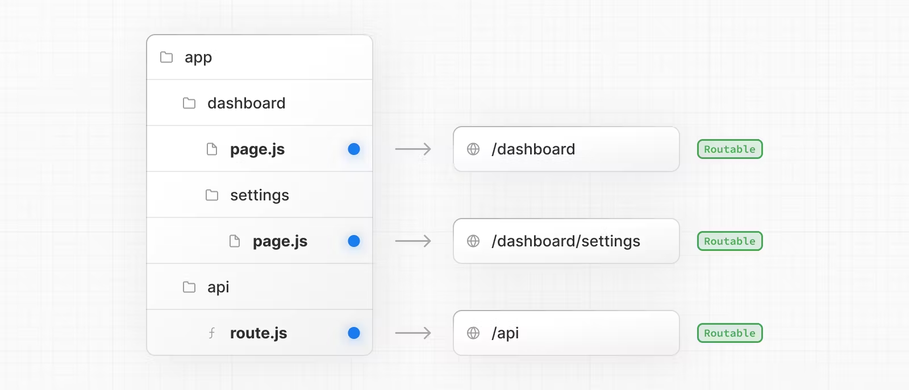
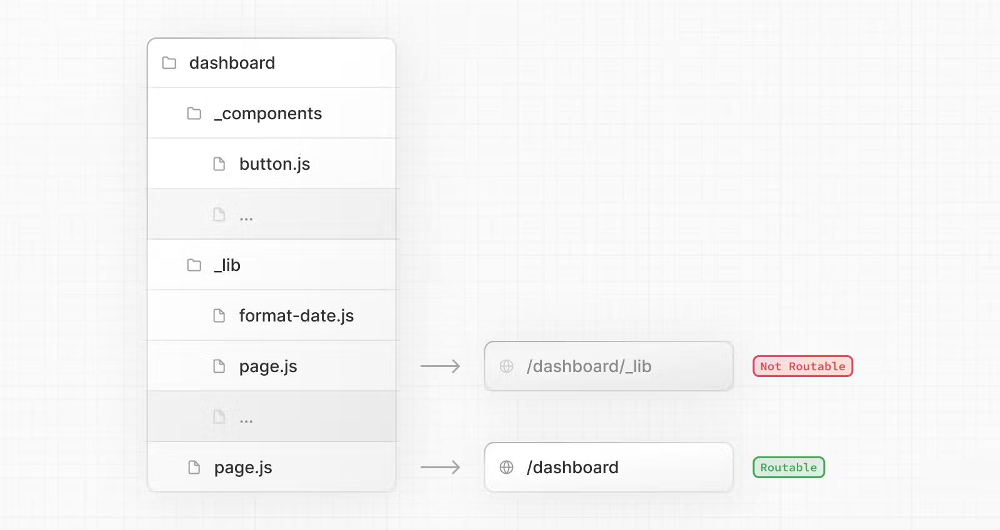
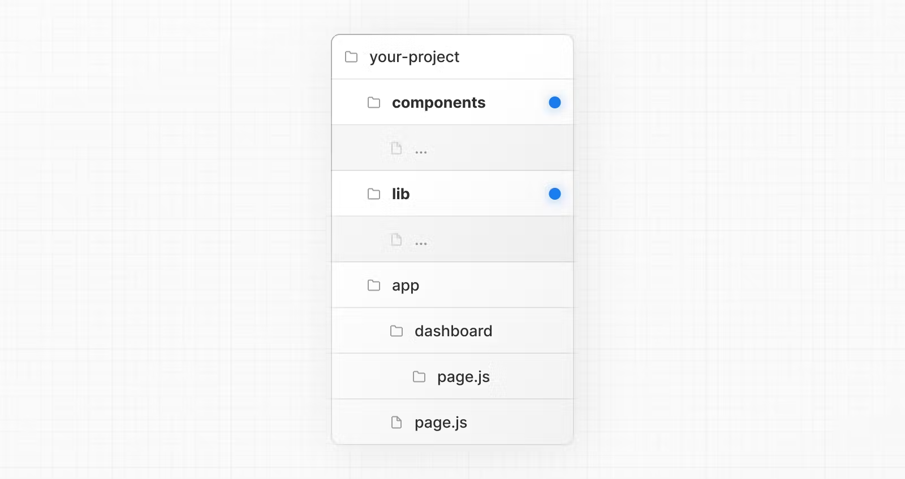
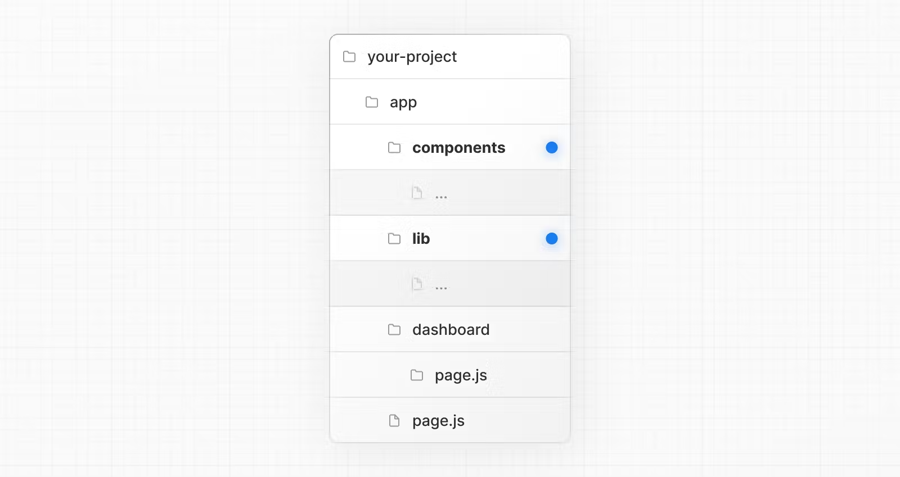
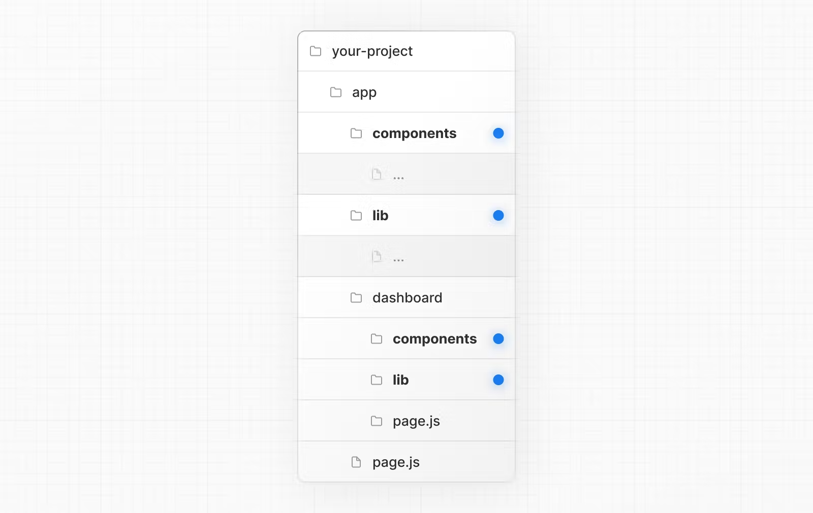

># **Route handlers**
- Cho phép tạo yêu cầu bằng route để request và response web api
- Đặt tên là route.tsx, lồng bên trong app nhưng ko dc cùng level với layout, page
- Tạo route để xử lý api phía backend
```js
import { NextResponse } from 'next/server'
 
export async function GET() {
  const res = await fetch('https://data.mongodb-api.com/...', {
    next: { revalidate: 60 }, // Revalidate every 60 seconds
  })
  const data = await res.json()
 
  return NextResponse.json(data)
}
```
----
# Cookies
- Bạn có thể độc cookies từ cookies của next/headers
- cookies từ next/header chỉ có thể đọc cookies, để đặt cookies, bạn cần return new Response sử dụng set-cookie
```js
import { cookies } from 'next/headers'
 
export async function GET(request: Request) {
  const cookieStore = cookies()
  const token = cookieStore.get('token')
 
  return new Response('Hello, Next.js!', {
    status: 200,
    headers: { 'Set-Cookie': `token=${token.value}` },
  })
}
``` 
----
# Headers : đọc và set headers bằng next/headers
```js
import { headers } from 'next/headers'
 
export async function GET(request: Request) {
  const headersList = headers()
  const referer = headersList.get('referer')
 
  return new Response('Hello, Next.js!', {
    status: 200,
    headers: { referer: referer },
  })
}
```
----
# Redirects
```js
import { redirect } from 'next/navigation'
 
export async function GET(request: Request) {
  redirect('https://nextjs.org/')
}
```
# Dynamic route Segment
- Route handler có thể sử dụng Dynamic segments để tạo yêu cầu lấy dữ liệu từ dynamic data
```js
export async function GET(
  request: Request,
  { params }: { params: { slug: string } }
) {
  const slug = params.slug // 'a', 'b', or 'c'
}
```
----
# Request Body
- Bạn có thể đọc yêu cầu body sử dụng method web api
```js
import { NextResponse } from 'next/server'
 
export async function POST(request: Request) {
  const res = await request.json()
  return NextResponse.json({ res })
}
```
----
# Cors

># **Middleware**
- Cho phép bạn chạy code trước khi yêu cầu được thực hiện
- Chạy trước khi nội dung được lưu trong bộ nhớ cache và các tuyến được khớp

----
# Convention
- Sử dụng middleware.tsx trong root của project để định nghĩa middleware. cùng cấp với layout,page,vv
```js
import { NextResponse } from 'next/server'
import type { NextRequest } from 'next/server'
 
// This function can be marked `async` if using `await` inside
export function middleware(request: NextRequest) {
  return NextResponse.redirect(new URL('/home', request.url))
}
 
// See "Matching Paths" below to learn more
export const config = {
  matcher: '/about/:path*',
}
```
---
# Matcher
- Cho phép bạn sử dụng middleware với đường dẫn cụ thể

># **Tổ chức dự án và vị trí file **
- Nextjs không có ý kiến về việc tổ chức và vị trí các file

# Safe colocation by default
- Mặc dù các route được được nghĩa thông qua các folder, nhưng route không phải là truy cập công khai nếu không có page.js hoặc route.js

- Khi 1 route được truy cập công khai, chỉ nội dụng được trả về từ file page.js hoặc route.js mới được gửi đến client


---
# Project organization features
## Private folders
- Các thư mục riêng tư có thể được tạo bằng cách thêm tiền tố vào một thư mục có dấu gạch dưới: _folderName

- Điều này cho biết thư mục là một chi tiết triển khai riêng tư và hệ thống định tuyến không nên xem xét, do đó chọn thư mục và tất cả các thư mục con của nó ra khỏi quá trình định tuyến


- Vị trí các tệp trong thư mục app có thể được đặt theo vị trí an toàn theo mặc định, các folder private có thể không cần thiết cho vị trí này, nhưng chúng có thể ữu ích khi:
1. Tách logic giao diện người dùng khỏi logic định tuyến.
2. Sắp xếp nhất quán các tệp nội bộ trong một dự án và hệ sinh thái Next.js.
3. Sắp xếp và nhóm các tệp trong trình chỉnh sửa mã.
4. Tránh xung đột đặt tên tiềm năng với các quy ước tệp Next.js trong tương lai.

# Route groups
- Được tạo bằng việc bọc folder theo (folderName)
- Tổ chức các nhóm route theo 1 group
- Cho phép lồng layout trong cùng 1 thành phần route
# Lưu trữ các file bên ngoài app
- Cho phép lưu trữ tất cả code của folder được chia sẻ vào root của pr , giữa cho thư mục app chỉ phục vụ cho định tuyến

# Lưu trữ file ở phần đầu folder trog app

# Tách các file dự án theo từng tính năng hoặc từng route


># **Internationalization**
- Nextjs cho phép bạn cấu hình các route và render ra nội dụng để hỗ trợ đa ngôn ngữ
More: https://nextjs.org/docs/app/building-your-application/routing/internationalization#localization